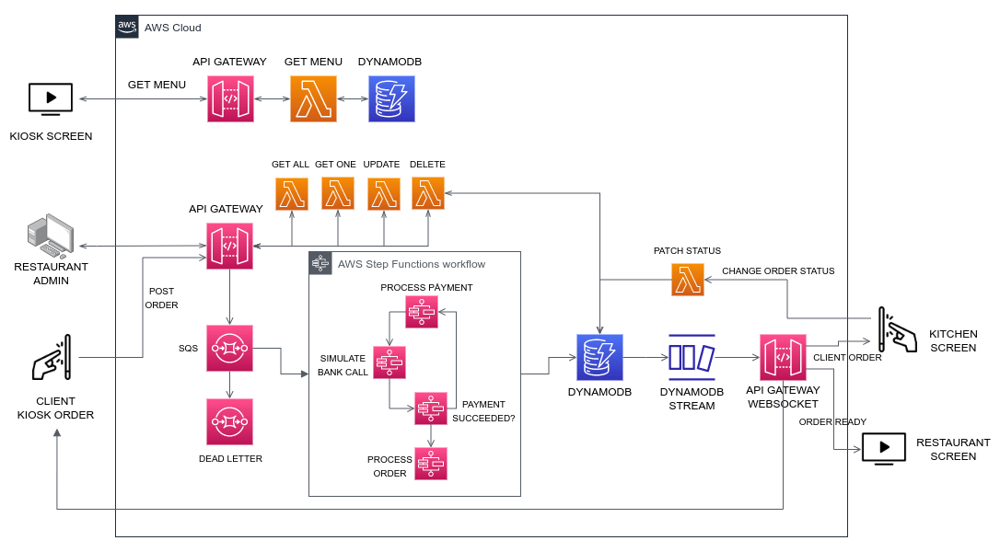

# KIOSK PROJECT - AWS Cloud Backend



## Tech used

AWS CDK / TypeScript

### Services Used

DynamoDB / DynamoDB Stream / API Gateway / API Gategay WebSocket / Lambdas / SQS / Step Functions

## Install instructions - Linux

- Install AWS CLI <https://docs.aws.amazon.com/cli/latest/userguide/getting-started-install.html>
- Install AWS CDK CLI `npm install -g aws-cdk`
- Create the `./.env` file from `./.env.sample`
- run `cdk bootstrap`
- Compile the typescript `make build`
- See have any error and the output of what will be build in the cloud `make build`
- Deploy to env `make deploy`
- See the table name in the CDK CloudFormation Output:

```bash
NomadCmsStack.MenuTableOutput = XXXX
```

- Update `data/menu-items.json` with the table name.
- Seed the Restaurant Menu: run `aws dynamodb batch-write-item --request-items file://data/menu-items.json`

Model of order Payload

```JSON
{
  "restaurantID": "d471fe1e-521a-48cf-bb80-2a8ab79c2457",
  "menuID": "ee367e37-34d1-4126-881f-43c77d792284",
  "orderItems": [
    {
      "quantity": 2,
      "productID": "c65796e8-0806-4bca-950a-ebc3db101707",
      "name": "Burguer 1",
      "value": "8.69"
    },
    {
      "quantity": 1,
      "productID": "13b3e55b-e3c0-46b8-93b1-8022abca2f75",
      "name": "Burguer 2",
      "value": "6.5"
    },
    {
      "quantity": 2,
      "productID": "42020fcd-46ed-47bc-9a23-9dd00b126560",
      "name": "Soda",
      "value": "2.75"
    }
  ],
  "total": "29.38"
}
```

The response from the command needs to be

```BASH
{
    "UnprocessedItems": {}
}
```

Teste the websocket: (install `npm install -g wscat`).

Copy the output of `NomadCmsStack.ordersWebsocketOutput`

run `wscat -c PASTE_OUTPUT_HERE`

The response needs to be

```bash
Connected (press CTRL+C to quit)
```

Any insert in the orders table will appears here.
